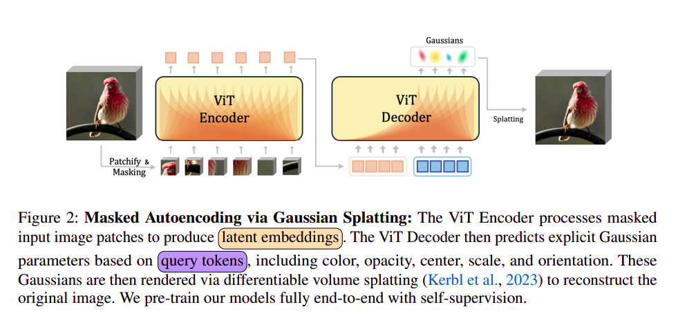
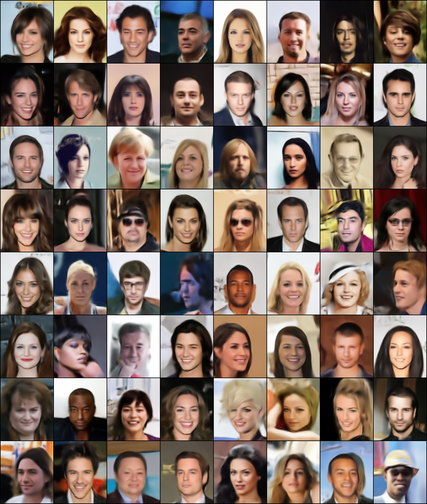

## Gaussian MAE (WIP)

</img>

<a href="https://arxiv.org/abs/2501.03229v1">Gaussian MAE</a> explores masked autoencoders (MAE) with gaussian splatting. It enables some zero shot capabilities via mid level gaussian based representations

These are some of the samples from gaussian mae after training on CelebA dataset for 2 epochs

</img>

To use the Gaussian MAE use
```python
dtype = torch.float32
device = 'cuda' if torch.cuda.is_available() else 'cpu'
gmae = GMAE(
    image_size=256,
    patch_size=8,
    encoder_dim=384,
    encoder_depth=6,
    encoder_heads=6,
    encoder_dim_head=64,
    num_gaussians=512,
    dropout=0.1,
    emb_dropout=0.0,
    decoder_dim=384,
    masking_ratio=0.75,
    decoder_depth=6,
    decoder_heads=6,
    decoder_dim_head=64,
    channels=3,
    add_gauss_pos=False
).to(device, dtype)

imgs = torch.randn(4, 3, 256, 256).to(device, dtype)

recon_loss = gmae(imgs)
recon_loss.backward()
```

To use the vanilla mae use the following
```python
from src.mae import MAE

dtype = torch.bfloat16
device = 'cuda' if torch.cuda.is_available() else 'cpu'
gmae = MAE(
    image_size = 256,
    channels = 3,
    patch_size = 4,
    masking_ratio = 0.75,

    # encoder configs
    encoder_dim = 512,
    encoder_depth = 8,
    encoder_heads = 8,
    encoder_dim_head = 64,

    # decoder configs
    decoder_dim = 512,
    decoder_depth = 8,
    decoder_heads = 8,
    decoder_dim_head = 64
).to(device, dtype)

imgs = torch.randn(7, 3, 256, 256).to(device, dtype)

loss = gmae(imgs)
```

To download and extract the dataset used for training run `source scripts/download.sh`

### Installation

```bash
# create conda env and install torch
conda create --name gmae -y python=3.10
conda activate gmae
pip install torch==2.1.2+cu118 torchvision==0.16.2+cu118 --extra-index-url https://download.pytorch.org/whl/cu118
conda install -c "nvidia/label/cuda-11.8.0" cuda-toolkit

# install gsplat
pip install git+https://github.com/nerfstudio-project/gsplat.git

# install the dependencies
pip install -e .
```

### Training Speed ups

Half Precision: 5.02it/s
full preicision: 3.48it/s

## Citations
```bibex
@misc{rajasegaran2025gaussianmaskedautoencoders,
      title={Gaussian Masked Autoencoders}, 
      author={Jathushan Rajasegaran and Xinlei Chen and Rulilong Li and Christoph Feichtenhofer and Jitendra Malik and Shiry Ginosar},
      year={2025},
      eprint={2501.03229},
      archivePrefix={arXiv},
      primaryClass={cs.CV},
      url={https://arxiv.org/abs/2501.03229}, 
}

@article{DBLP:journals/corr/abs-2111-06377,
  author       = {Kaiming He and
                  Xinlei Chen and
                  Saining Xie and
                  Yanghao Li and
                  Piotr Doll{\'{a}}r and
                  Ross B. Girshick},
  title        = {Masked Autoencoders Are Scalable Vision Learners},
  journal      = {CoRR},
  volume       = {abs/2111.06377},
  year         = {2021},
  url          = {https://arxiv.org/abs/2111.06377},
  eprinttype    = {arXiv},
  eprint       = {2111.06377},
  timestamp    = {Tue, 16 Nov 2021 12:12:31 +0100},
  biburl       = {https://dblp.org/rec/journals/corr/abs-2111-06377.bib},
  bibsource    = {dblp computer science bibliography, https://dblp.org}
}
```
